# RailConnect

> **Smart Railway Operations & Passenger Management Platform**

RailConnect is a full-stack, next-generation smart railway management platform designed to streamline passenger bookings, real-time schedule tracking, station directory management, PNR lookups, cancellation workflows, user notifications, and administrative operational analytics.

Built using **React.js**, **Vite**, **Node.js**, **Express.js**, and **MongoDB with Mongoose**, it offers a modern SaaS UI, robust role-based access control, and aggregation-driven administrative insights.

---

## For Running This Project Follow The Commands Below

- **1. Clone the Repository:**
  ```bash
  git clone https://github.com/vyomshah14/Rail-Connect.git
  cd Railconnect
  ```

- **2. Install Dependencies:**
  ```bash
  npm install
  cd server && npm install && cd ..
  ```

- **3. Setup Environment Variables:**
  - Create a `.env` file in the root directory:
    ```env
    VITE_API_URL=http://localhost:5000
    ```
  - Create a `server/.env` file in the `server` directory:
    ```env
    MONGO_URI=mongodb://localhost:27017/Rail-connect
    JWT_SECRET=railconnectsecret
    ```

- **4. Seed Default Admin Credentials (Optional):**
  ```bash
  node server/seedAdmin.js
  ```
  *(Default Admin: `admin@railconnect.com` / Password: `adminpassword`)*

- **5. Run the Project:**
  - **Start Backend Server:**
    ```bash
    node server/server.js
    ```
    *(Backend runs on `http://localhost:5000`)*

  - **Start Frontend Dev Server:**
    ```bash
    npm run dev
    ```
    *(Frontend opens at `http://localhost:5173`)*

---

# Screenshots

### **Homepage & Landing Page**
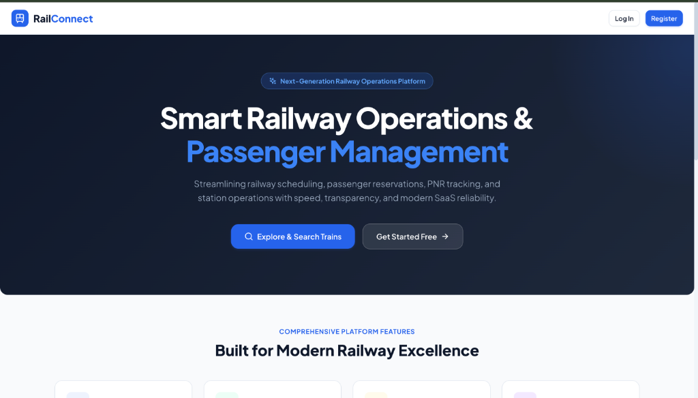
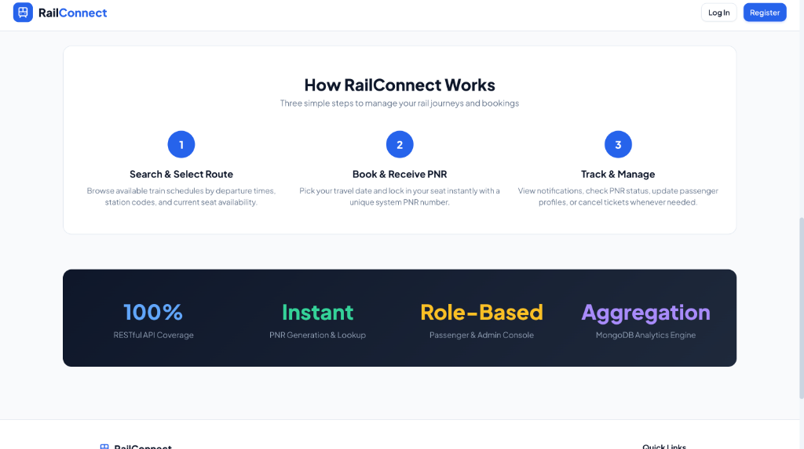

### **Authentication (Login & Register)**
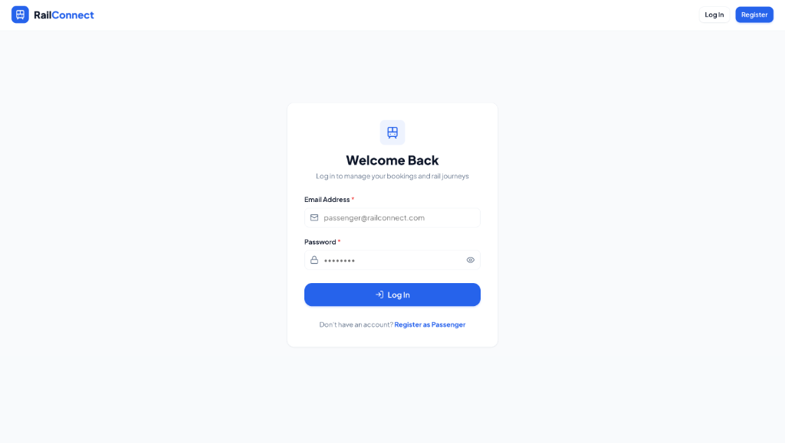
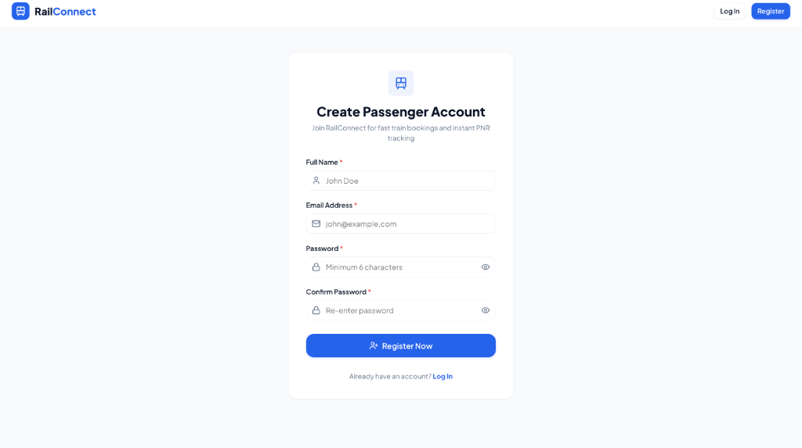

### **Passenger Dashboard & Profile**
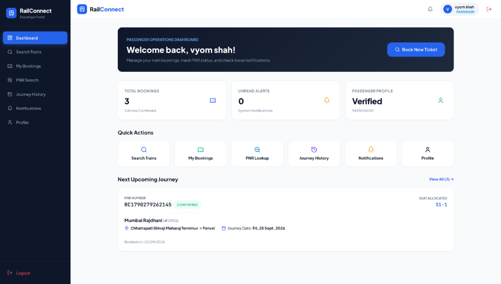
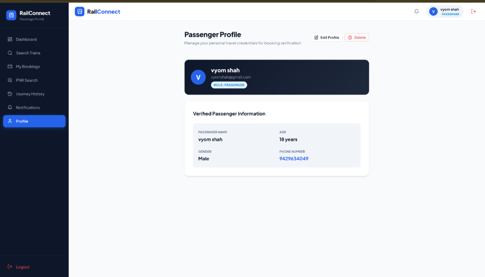

### **Train Search & Booking Flow**
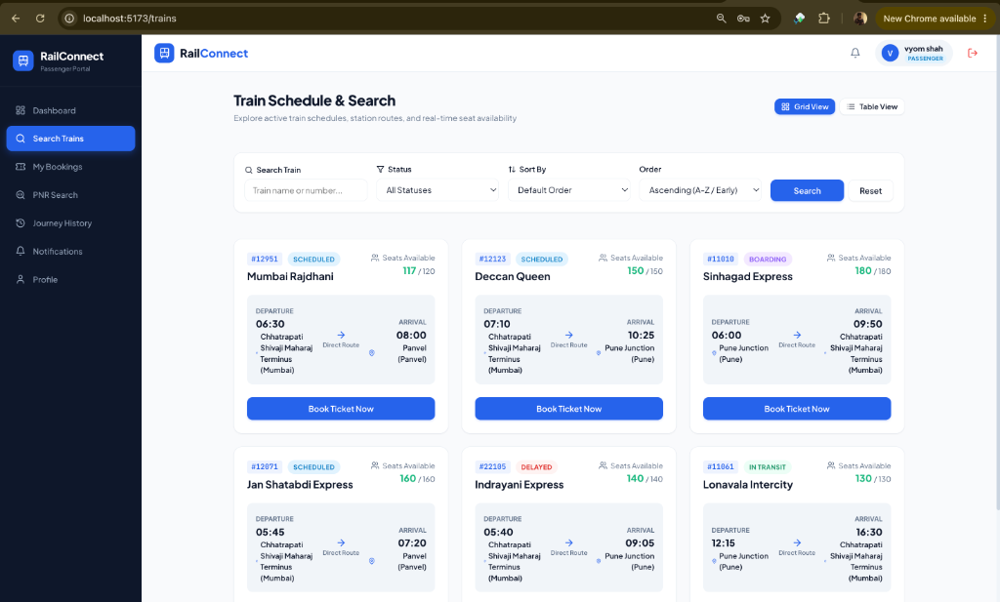
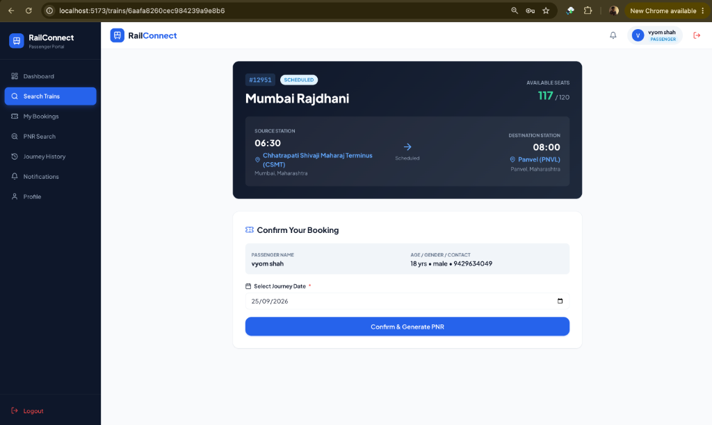

### **Bookings, PNR Lookup & History**
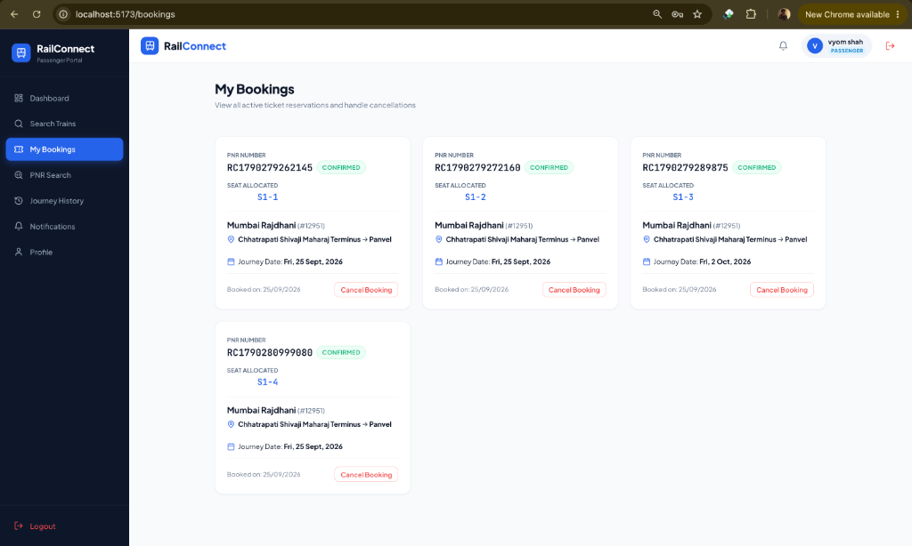
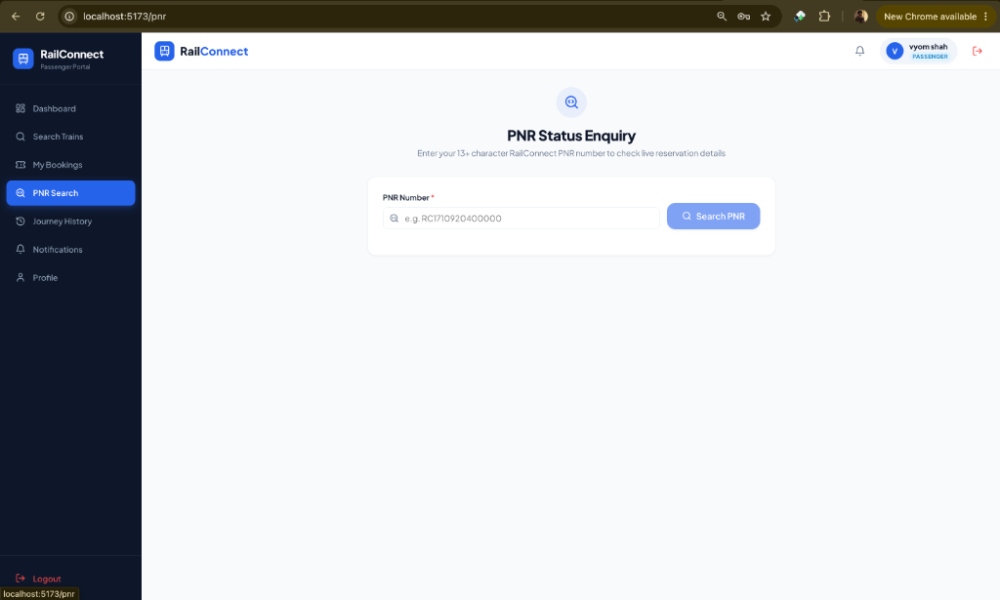
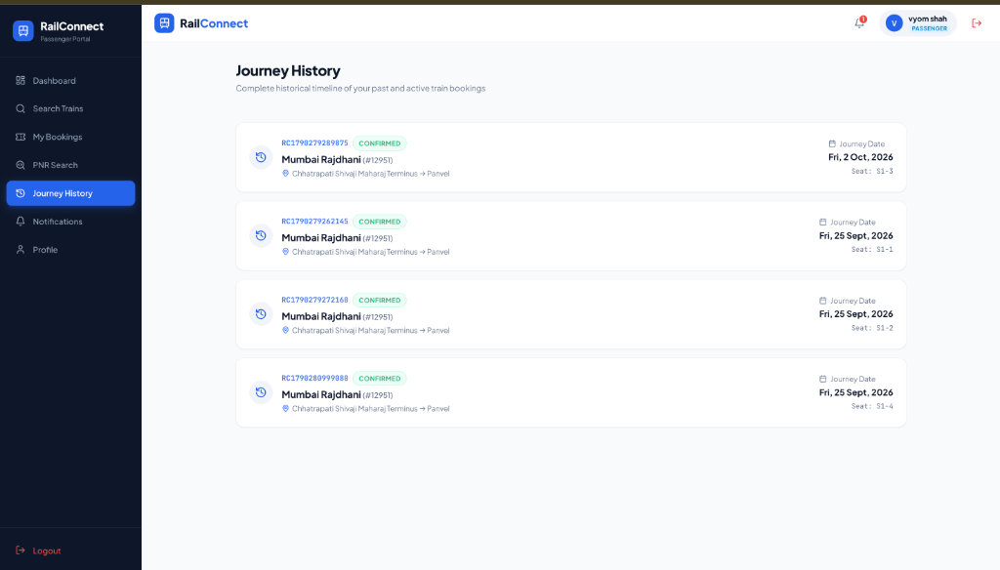

### **Notifications & System Alerts**
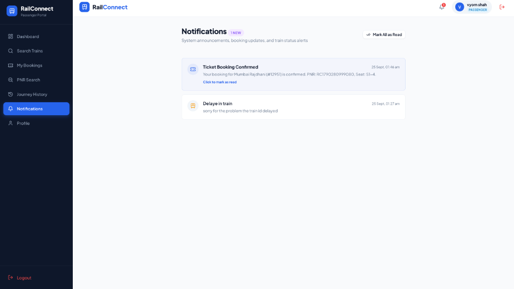

### **Admin Console & Operations**
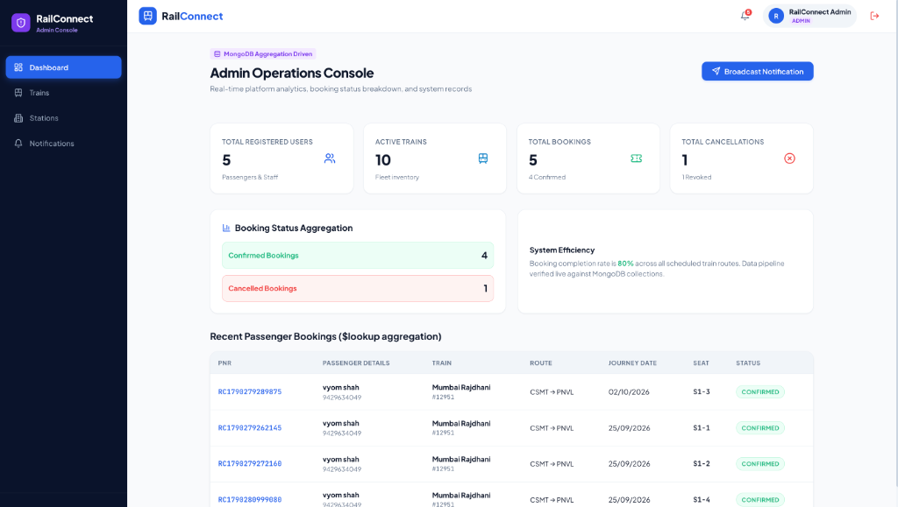
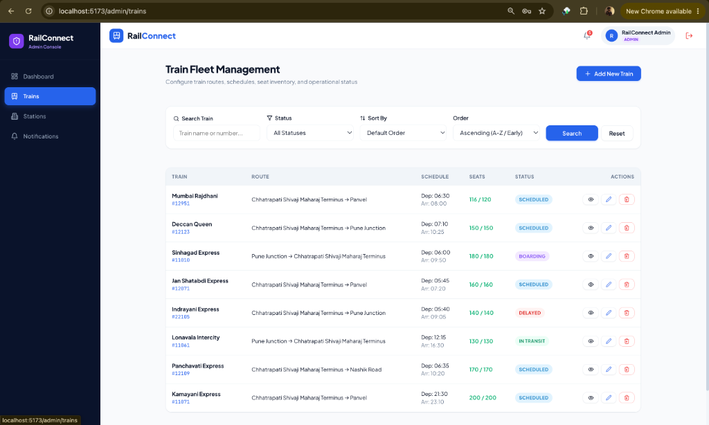
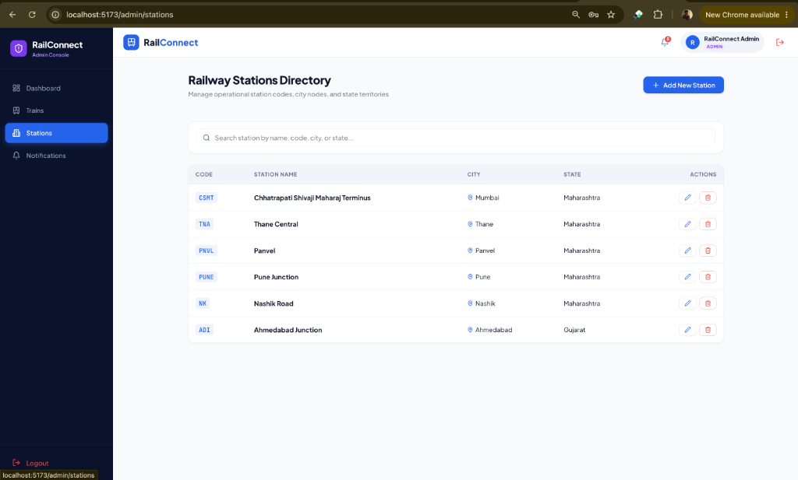
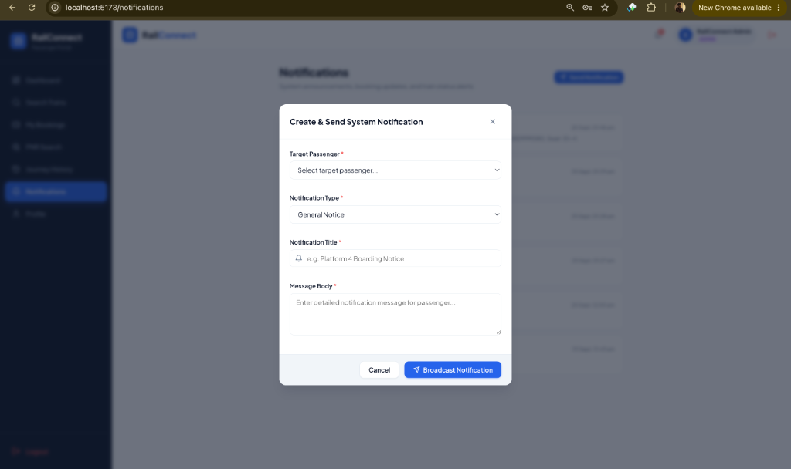

---

## Key Features & Highlights

1. **Advanced Train Search, Filtering, Sorting & Pagination**
   - Search by train name or train number.
   - Filter by operational status (`scheduled`, `boarding`, `in_transit`, `delayed`, `cancelled`, etc.).
   - Sort by departure time or train name (ascending/descending).
   - Server-side pagination with dynamic seat availability badges.

2. **Role-Based Access Control (RBAC)**
   - Role-protected routes for Admin vs Passenger vs Staff.
   - `AccessDeniedPage` (403) guard when non-admins attempt to access admin routes.

3. **MongoDB Aggregation-Based Admin Dashboard**
   - Aggregation pipelines (`$match`, `$lookup`, `$group`, `$sort`, `$unwind`) calculating total users, fleet count, booking status breakdowns (`confirmed`/`cancelled`), and joined passenger-train-station records.

4. **User Notification & System Alert Engine**
   - Automatic notifications generated on ticket bookings & cancellations.
   - Admin Broadcast Notification Modal for sending system-wide or user-targeted alerts.
   - Real-time unread badge counter in navbar with inline mark-as-read.

5. **Passenger Profile & PNR Management**
   - Auto-checks passenger profile completeness before allowing booking.
   - Unique PNR number allocation & instant PNR query lookup engine.

---

## Tech Stack

### **Frontend**
- React.js (v18)
- Vite
- React Router DOM (v6)
- Lucide React (Modern Iconography)
- CSS3 (Custom Design Tokens & Responsive Layout)

### **Backend**
- Node.js
- Express.js
- JSON Web Token (JWT)
- bcryptjs
- Mongoose (MongoDB ODM)
- CORS & Dotenv

### **Database & Tools**
- MongoDB / MongoDB Compass
- Git & GitHub
- Postman / Curl

---

## Project Structure

```text
Railconnect/
├── public/
│   └── favicon.svg
│
├── screenshots/                  # Project UI Screenshots
│   ├── 01-homepage-hero.png
│   ├── 02-homepage-features.png
│   ├── 03-login-page.png
│   ├── 04-register-page.png
│   ├── 05-passenger-dashboard.png
│   ├── 06-passenger-profile.png
│   ├── 07-train-search.png
│   ├── 08-train-booking.png
│   ├── 09-my-bookings.png
│   ├── 10-pnr-search.png
│   ├── 11-journey-history.png
│   ├── 12-notifications.png
│   ├── 13-admin-dashboard.png
│   ├── 14-admin-trains.png
│   ├── 15-admin-stations.png
│   └── 16-admin-broadcast-modal.png
│
├── src/
│   ├── api/
│   │   ├── api.js                # Core API client & error handling
│   │   ├── authApi.js            # Login & Register endpoints
│   │   ├── trainApi.js           # Train CRUD & search endpoints
│   │   ├── stationApi.js         # Station CRUD endpoints
│   │   ├── passengerApi.js       # Passenger profile endpoints
│   │   ├── bookingApi.js         # Booking & PNR endpoints
│   │   ├── cancellationApi.js    # Cancellation endpoint
│   │   ├── dashboardApi.js       # Admin aggregation stats endpoint
│   │   └── notificationApi.js    # Notification endpoints
│   │
│   ├── components/
│   │   ├── common/               # Navbar, Sidebar, AdminSidebar, Modals, Badges
│   │   ├── trains/               # TrainCard, TrainTable, SearchBar, Pagination
│   │   ├── bookings/             # BookingCard
│   │   ├── notifications/        # NotificationItem
│   │   └── admin/                # TrainModal, StationModal, CreateNotificationModal
│   │
│   ├── context/
│   │   ├── AuthContext.jsx       # Auth state & passenger profile status
│   │   └── ToastContext.jsx      # Global toast notification provider
│   │
│   ├── hooks/
│   │   ├── useAuth.js
│   │   └── useToast.js
│   │
│   ├── layouts/
│   │   ├── PublicLayout.jsx
│   │   ├── PassengerLayout.jsx
│   │   └── AdminLayout.jsx
│   │
│   ├── pages/
│   │   ├── LandingPage.jsx
│   │   ├── LoginPage.jsx
│   │   ├── RegisterPage.jsx
│   │   ├── DashboardPage.jsx
│   │   ├── TrainsPage.jsx
│   │   ├── TrainDetailPage.jsx
│   │   ├── MyBookingsPage.jsx
│   │   ├── PnrSearchPage.jsx
│   │   ├── HistoryPage.jsx
│   │   ├── ProfilePage.jsx
│   │   ├── NotificationsPage.jsx
│   │   ├── AdminDashboardPage.jsx
│   │   ├── AdminTrainsPage.jsx
│   │   ├── AdminStationsPage.jsx
│   │   └── AccessDeniedPage.jsx
│   │
│   ├── styles/
│   │   ├── variables.css
│   │   ├── global.css
│   │   └── layout.css
│   │
│   ├── App.jsx                   # Central Router definition
│   └── main.jsx                 # Entry point
│
├── server/
│   ├── config/
│   │   └── db.js                 # MongoDB connection config
│   ├── controllers/              # Auth, trains, stations, bookings, etc.
│   ├── middleware/               # Auth, Role, Error & Validation middleware
│   ├── models/                   # User, Passenger, Station, Train, Booking, Cancellation, Notification
│   ├── route/                    # Express API routes
│   ├── seedAdmin.js              # Script to seed default admin credentials
│   └── server.js                 # Express server entry point
│
├── .env.example
├── .gitignore
├── index.html
├── package.json
├── package-lock.json
├── vite.config.js
└── README.md
```

---

## Contributing

Contributions are welcome! If you have suggestions, bug reports, or feature requests, feel free to open an issue or submit a pull request.

1. Fork the repository
2. Create your feature branch (`git checkout -b feature/AmazingFeature`)
3. Commit your changes (`git commit -m 'Add some AmazingFeature'`)
4. Push to the branch (`git push origin feature/AmazingFeature`)
5. Open a Pull Request

---

## License

This project is licensed under the [MIT License](LICENSE). Feel free to modify and distribute it as per terms of the license.

---

## Acknowledgements

We would like to acknowledge the following resources used in the development of this project:
- React.js & Vite
- Express.js & Node.js
- MongoDB & Mongoose
- Lucide React Icons
- Plus Jakarta Sans & JetBrains Mono Fonts

---

## Contact

For any inquiries or questions, please reach out to:
- **Project Maintainer**: Vyom Shah ([vyomshah14](https://github.com/vyomshah14))

Thank you for visiting **RailConnect**! We hope this platform provides a valuable learning and operational experience.
